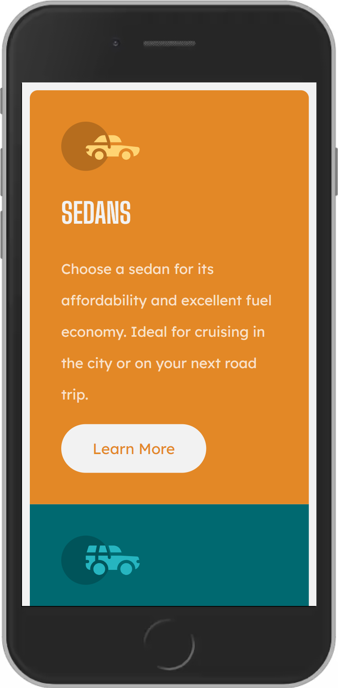
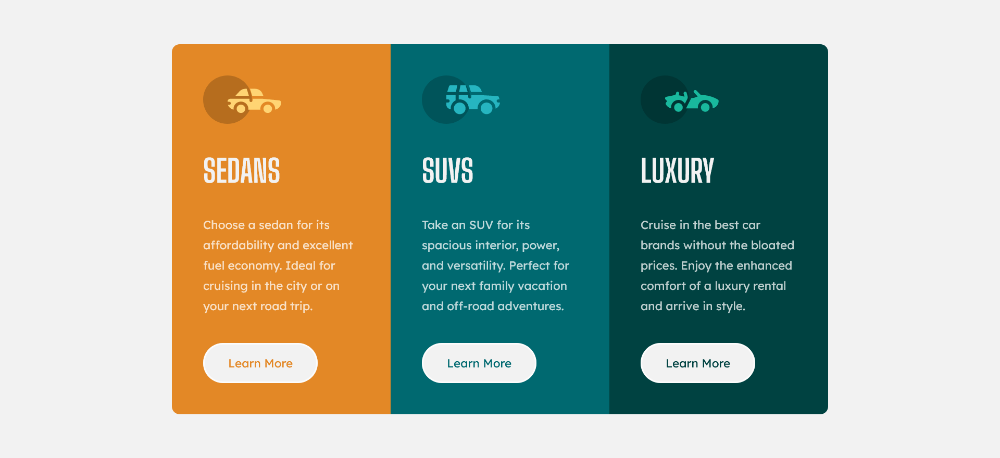

# 3 Column Preview Card Component - Solución

Esta es una solución del proyecto [3 Column Preview Card Component](https://www.frontendmentor.io/challenges/3column-preview-card-component-pH92eAR2-), diseño original de [Frontend Mentor](https://www.frontendmentor.io/challenges). Los desafíos de Frontend Mentor nos ayudan a mejorar las habilidades de codificación, mediante el desarrollo de proyectos reales.

## Tabla de contenidos

- [Vision general](#vision-general)
  - [El desafio](#el-desafio)
  - [Capturas](#capturas)
  - [Enlaces](#enlaces)
- [Proceso de trabajo](#proceso-de-trabajo)
  - [Desarrollo](#desarrollo)
  - [Lo que aprendi](#lo-que-aprendi)
  - [Lo que aprendere](#lo-que-aprendere)
  - [Recursos](#recursos)
- [Autor](#autor)
- [Agradecimientos](#agradecimientos)

## Vision general

### El desafio

Los usuarios deben ser capaces de:

- Ver el diseño óptimo según el tamaño de pantalla del dispositivo
- Ver estados `hover` para elementos interactivos

### Capturas




### Enlaces

- [Codigo fuente](https://github.com/xantosromerodev/3-column-preview-card-component)
- [Pagina web](https://3-column-preview-w-card-component.vercel.app/)
- [Apoyanos](https://www.buymeacoffee.com/xantosromero)

## Proceso de trabajo

### Desarrollo

- Marcado HTML
- Propiedades CSS
- CSS Flexbox
- CSS Grid
- Flujo de trabajo mobile-first

### Lo que aprendi

En cuanto al código del proyecto:
- Agregué etiquetas `<meta>` como `author` y `description` dentro del elemento `<head>`
- Utilicé el archivo `normalize.css` para resetear los estilos predeterminados del navegador
- Aplicamos el flujo de trabajo mobile-first, primero codificamos para dispositivos pequeños, y luego para pantallas grandes
- Utilicé CSS Flexbox para alinear la tarjeta en el centro de la pantalla en pantallas grandes
- Utilicé CSS Grid para alinear en columnas (mobile) las tarjetas, y en fila para pantallas grandes
- Utilicé variables CSS para agregar los colores del proyecto

Etiquetas `<meta>` dentro de `<head>`:

```html
<head>
    <meta name="author" content="Santos Romero">
    <meta name="description" content="A nice 3 column preview card component project">
</head>
```

CSS Grid:
```css
/* mobile-first */
.container {
    display: grid;
    grid-template-columns: 1fr;
    grid-template-rows: 3fr;
    margin: 10px;
}
```

CSS Flexbox:
```css
body {
    display: flex;
    flex-direction: column;
    align-items: center;
    justify-content: center;
    height: 100vh;
    overflow: hidden;
}
```

Variables CSS
```css
* {
    --bright-orange: hsl(31, 77%, 52%);
    --dark-cyan: hsl(184, 100%, 22%);
    --very-dark-cyan: hsl(179, 100%, 13%);

    --transp-white: hsla(0, 0%, 100%, 0.75); /* parrafos*/
    --very-light-gray: hsl(0, 0%, 95%); /* fondo, titulos, botones */
}
```

### Lo que aprendere

Investigaré más sobre especificidad, herencia y cascada en CSS. También, estudiaré más sobre la metodología BEM.


### Recursos

- [Normalize](https://necolas.github.io/normalize.css/) - Archivo para resetear los estilos predeterminados de los navegadores
- [BEM Cheat Sheet](https://bem-cheat-sheet.9elements.com/) - Una página web con ejemplos e información sobre la metodología BEM


## Autor

- LinkedIn - [@xantosromero](https://www.linkedin.com/in/xantosromero/)
- Frontend Mentor - [@xantosromero](https://www.frontendmentor.io/profile/xantosromerodev)
- Hashnode - [@xantosromero](https://xantosromero.hashnode.dev/)


## Agradecimientos

> "Todo es difícil antes de ser fácil." **Goethe**

> "Exígete mucho a ti mismo y espera poco de los demás. Así te ahorrarás muchos disgustos." **Confucio**

Agradecido con el ser supremo (Dios), Frontend Mentor, W3Schools y Codepen.
